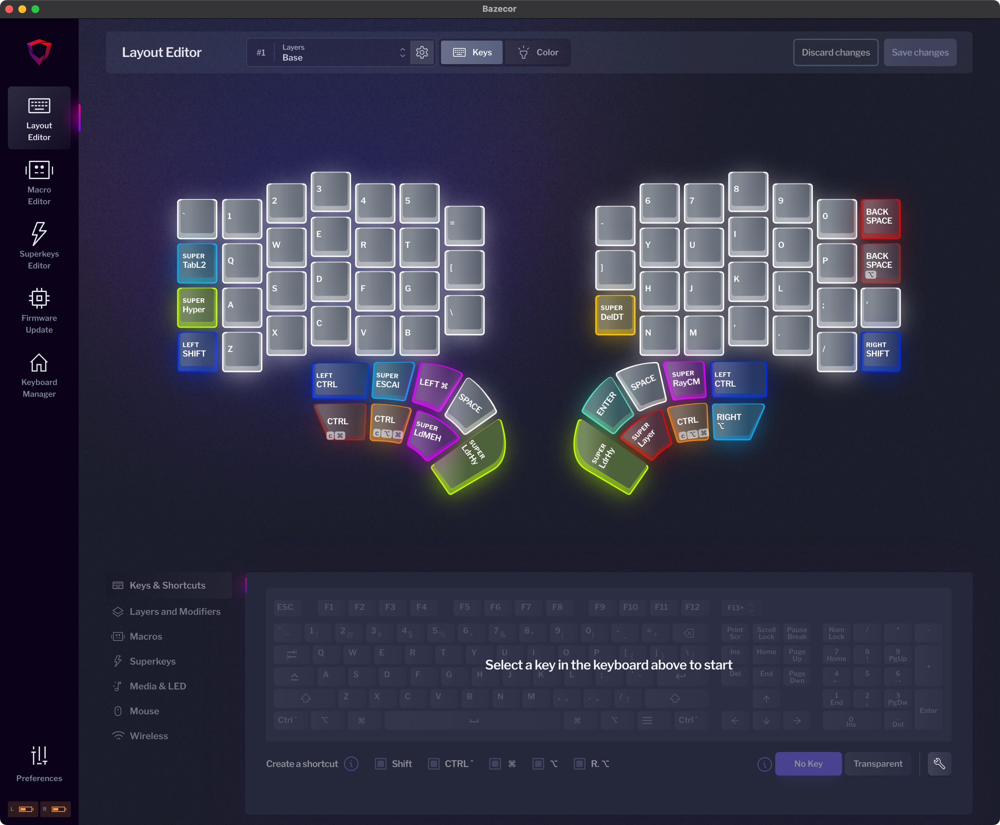
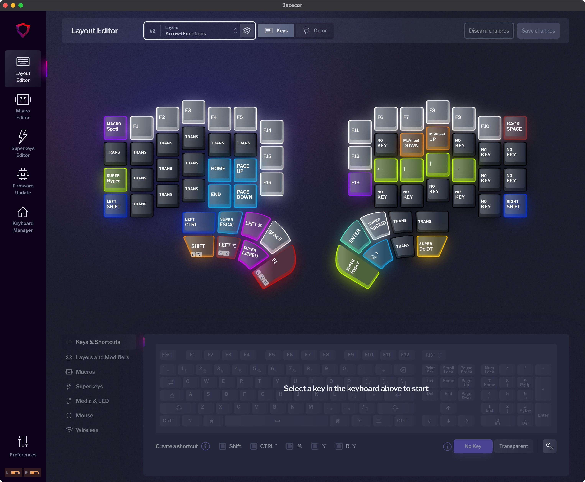
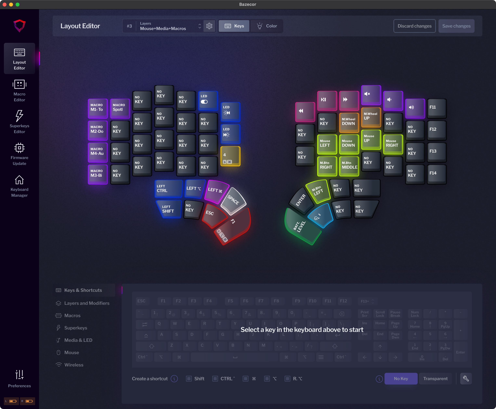
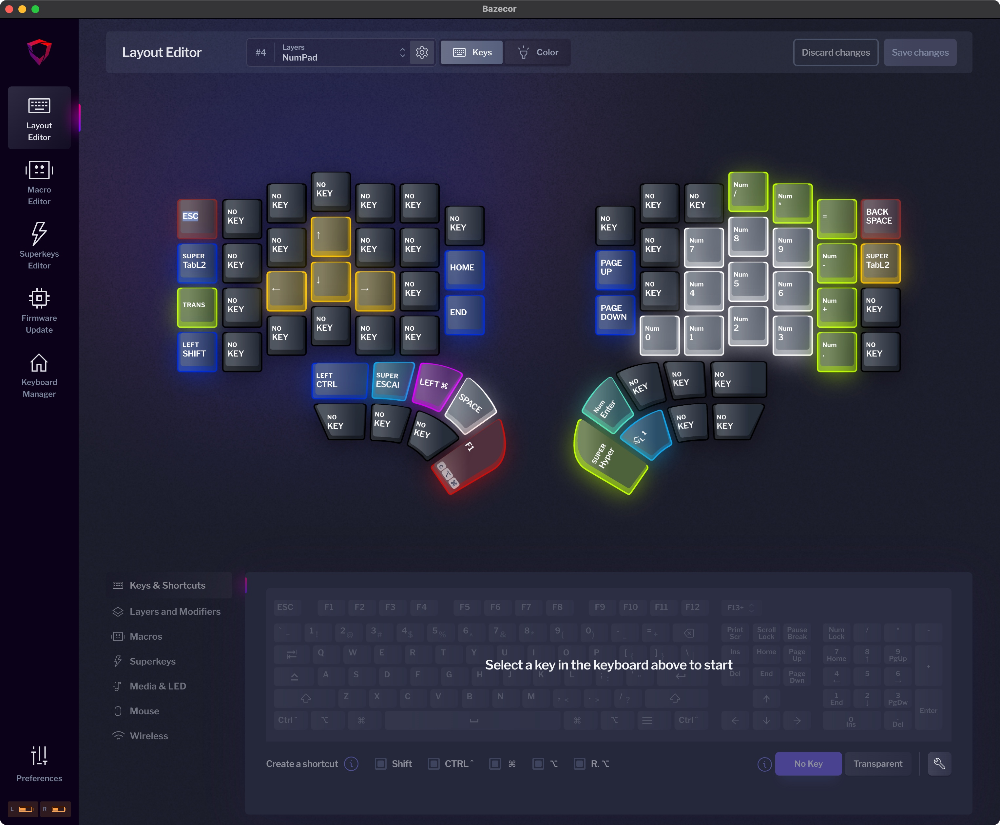
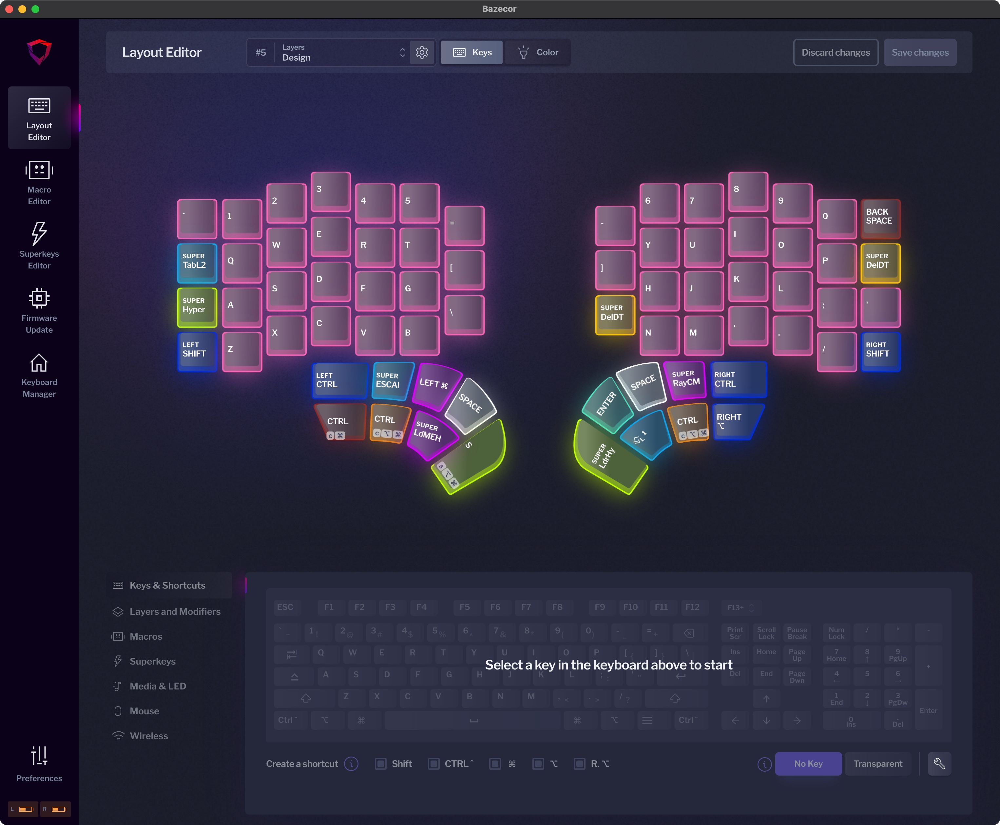
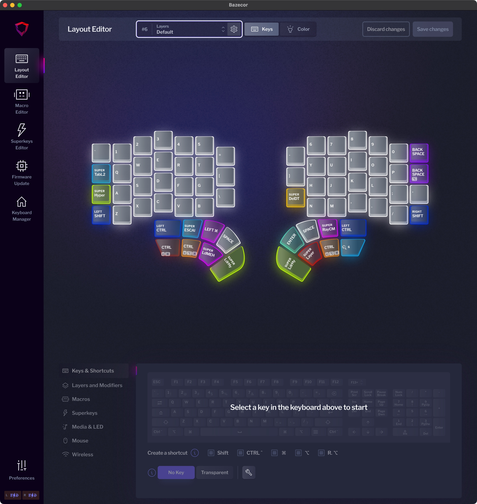

```
███████╗   ██████╗ ███████╗███████╗██╗   ██╗
██╔════╝   ██╔══██╗██╔════╝██╔════╝╚██╗ ██╔╝
█████╗     ██║  ██║█████╗  █████╗   ╚████╔╝
██╔══╝     ██║  ██║██╔══╝  ██╔══╝    ╚██╔╝
███████╗██╗██████╔╝███████╗██║        ██║
╚══════╝╚═╝╚═════╝ ╚══════╝╚═╝        ╚═╝

```

# E.Defy

> [!NOTE]
> The repos is a part of my [Dotfiles](https://github.com/edheltzel/dotfiles)

### My personal setup for monkey punching 🐒 code with the Dygma Defy

Hey there 👋, I'm EdHeltzel and you've found my personal setup for the [Dygma Defy keyboard](https://dygma.com/pages/defy). You'll need to use [Bazecore](https://github.com/Dygmalab/Bazecor) to import the `json` configs, and have the [latest firmware](https://github.com/Dygmalab/Firmware-release) for the Defy.

This repos as noted above is
a part of my personal [Dotfiles](https://github.com/edheltzel/dotfiles). Be inspired, take what you want, and leave the
rest to make it your own.

- [E.DOTS - Dofiles](https://github.com/edheltzel/dotfiles)
- [NEO.ED - Neovim Config](https://github.com/edheltzel/neoed)

## Layers

<details open>
<summary><strong>L1 - Base (Homerow Mods)</strong></summary>

[Layer Config](2025-12-28--Base.json)

Includes shift and ctrl on the homerow for efficient modifier access while typing.



</details>

<details>
<summary><strong>L2 - Arrows & Functions</strong></summary>

[Layer Config](2025-12-22--ArrowFunctions.json)



</details>

<details>
<summary><strong>L3 - Mouse & Macros</strong></summary>

[Layer Config](2025-12-22--MouseMediaMacos.json)



</details>

<details>
<summary><strong>L4 - Numpad</strong></summary>

[Layer Config](2025-12-22--Numpad.json)



</details>

<details>
<summary><strong>L5 - Design</strong></summary>

[Layer Config](2025-12-22--Design.json)



</details>

<details>
<summary><strong>L6 - Default</strong></summary>

[Layer Config](2025-12-28--DefaultNoHomeRowMods.json)

Same as the Base layer without homerow mods.



</details>
